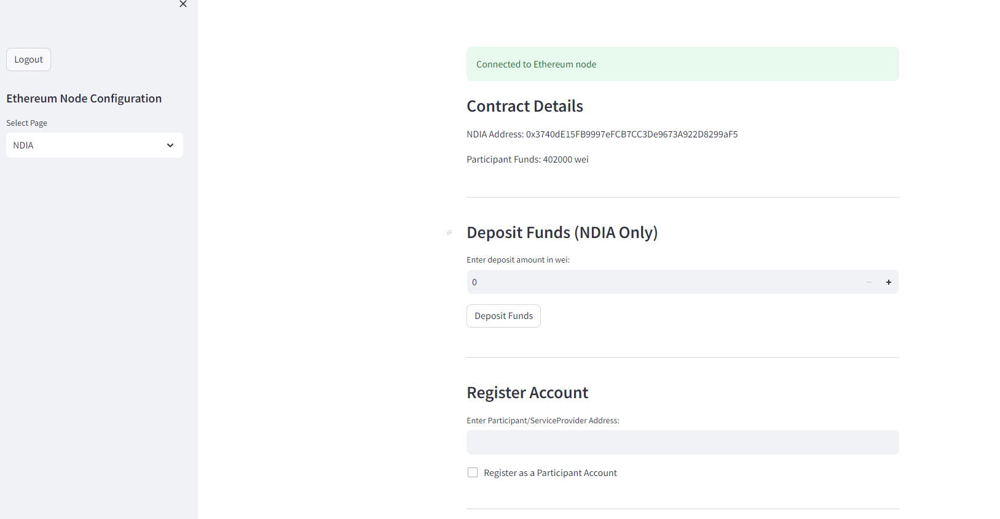
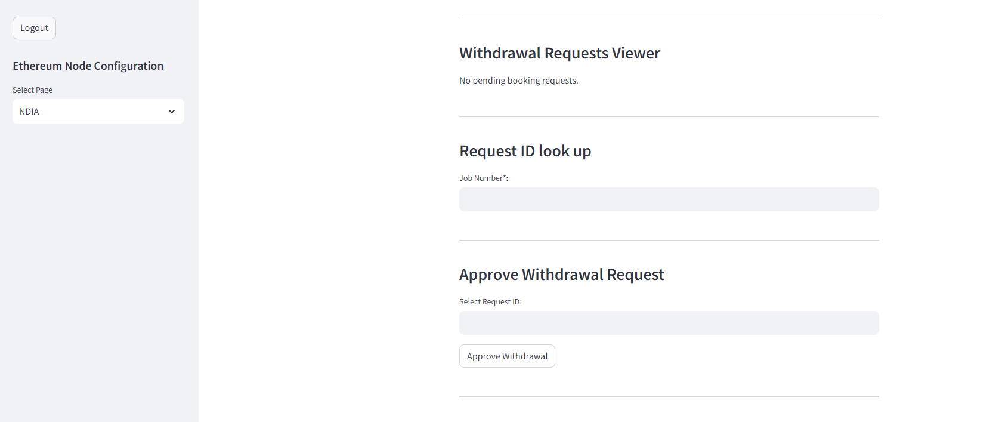
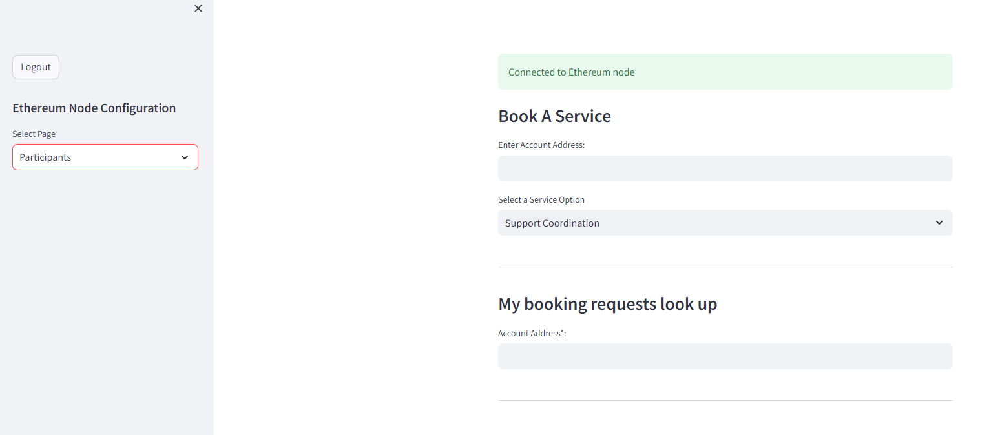
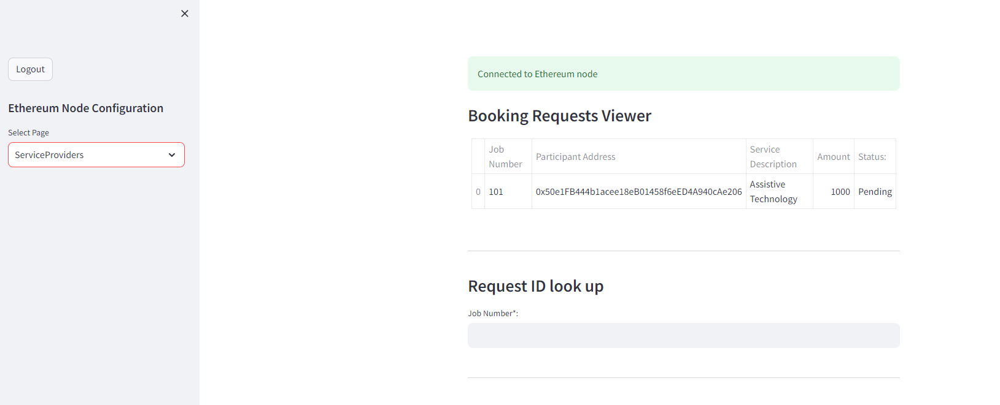
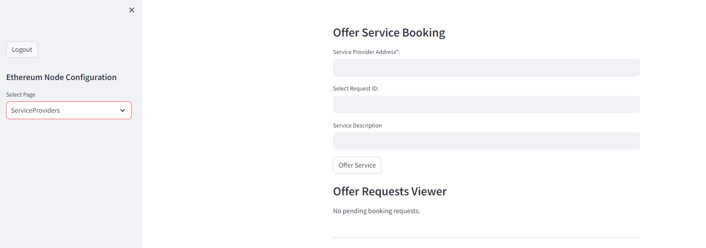
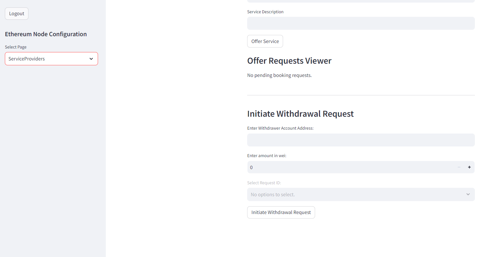
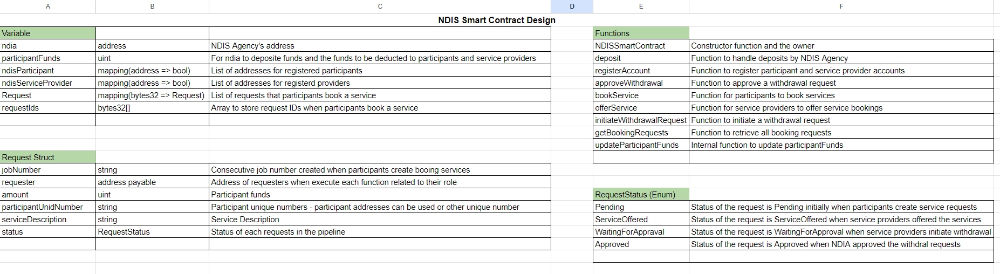
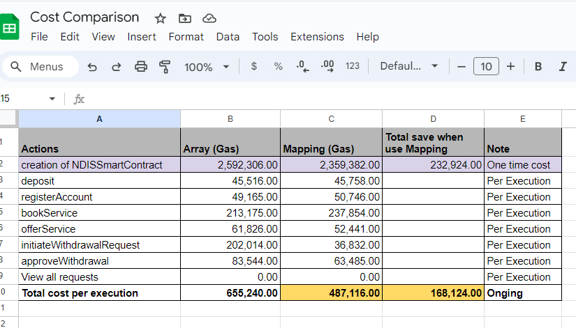

# Executive Summary

The National Disability Insurance Scheme (NDIS) has significantly transformed disability support in Australia, aiming to empower individuals with disabilities and elevate their quality of life. Integrating smart contracts within the NDIS offers an opportunity to simplify processes, enhance transparency, and ensure efficient resource allocation. Smart contracts, being self-executing agreements with terms encoded, provide a secure and automated approach to managing various NDIS aspects, potentially automating fund distribution and service execution, reducing administrative burden, and ensuring transparent fund usage. This integration aligns with the NDIS's goal of delivering effective, transparent, and participant-focused disability support services, demonstrating a commitment to leveraging fintech innovations to enhance financial management and service delivery within the disability support sector.

## Proof of Concept - Basic Framework & Methodologies

### Smart Contract Deployment
- Remix IDE
- Ganache
- Python
- Streamlit

### User Interface Screenshots
- Provide screenshots of the user interface illustrating the integration of smart contracts.
- NDIA Interface Screenshot
  
  
  

 - Participant Interface Screenshot
  

  - Provider Interface Screenshot
  
  
  
  
  
  

- Download video demo here: 

  [Watch the demonstration video](media/Recording 2024-02-13 202834.mp4)

### Walkthrough Details
- NDIS Smart Contract Design.
- 

- Cost comparison 
- .

## Next Steps - Exploring Beyond Smart Contract Execution

### Machine Learning Integration
- Explore the role of machine learning in analyzing large datasets related to NDIS processes.
- Identify patterns and trends to inform conditions and terms within smart contracts.

### Dynamic Adaptation
- Demonstrate how machine learning insights can dynamically adjust smart contract terms in real-time.
- Showcase the adaptability and responsiveness of the system based on evolving conditions.

### Risk Assessment and Fraud Detection
- Implement machine learning models for risk assessment and fraud detection within the smart contract environment.
- Showcase how automated decision-making can enhance security and optimize contract performance.

## Considerations - Ethical and Regulatory Implications

### Data Privacy and Security
- Address data privacy concerns by implementing robust encryption and access control measures.
- Ensure compliance with relevant data privacy regulations to protect sensitive information.

### Legal Frameworks
- Emphasize the importance of establishing comprehensive legal frameworks for digital transactions.
- Collaborate with regulatory bodies to define guidelines and standards governing the use of smart contracts.

### Ethical Use of Technology
- Mitigate biases in algorithms by implementing fairness and transparency measures.
- Promote accessibility for all users and adhere to ethical principles in the deployment of blockchain and smart contract technologies.

## Conclusions

The proof of concept demonstrates the feasibility of integrating smart contracts within the NDIS, offering a secure and transparent solution. The exploration of machine learning opens avenues for dynamic adaptation and automated decision-making. Ethical and regulatory considerations underscore the commitment to responsible deployment, aligning with the NDIS's goal of improving service delivery and enhancing the lives of individuals with disabilities. The proposed framework not only leverages fintech innovations but also sets the stage for continuous improvement in accuracy, efficiency, and responsiveness within the disability support sector.

